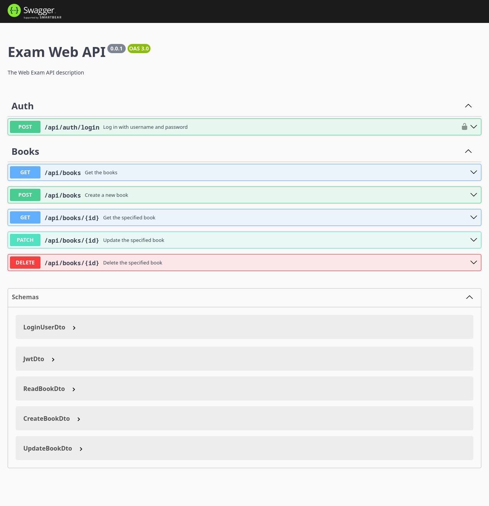
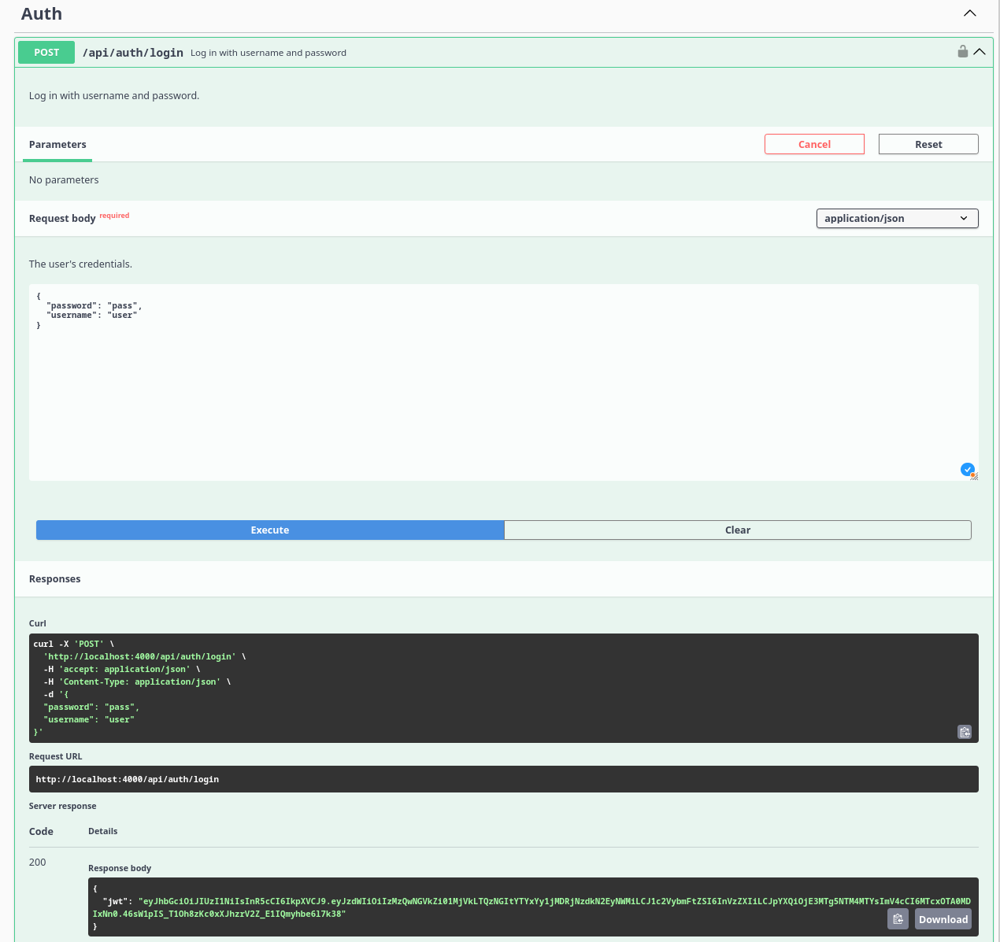
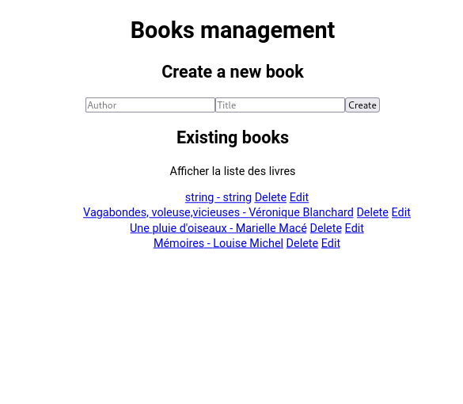
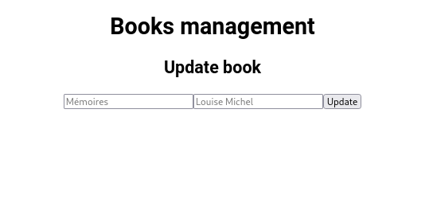

# Web Exam 2024

READ CAREFULLY THE INSTRUCTIONS. You must implement the frontend only and respond to some questions [QUESTIONS.md](./QUESTIONS.md). You do not need to implement the backend. You can test your frontend with the backend running on your machine.

## Context

You have a backend with an API that lets you authenticate with JWT and manage books. You need to enhance the frontend to allow a user to authenticate and manage books.

A [README.md](./backend/README.md) is available in the backend folder to help you get started with the backend. The same goes for the frontend.

Once your backend is running, you can access the documentation of the API at http://localhost:4000/api. You should see :

You can directly test your API from this page. For example, you can try to authenticate with the following credentials `{ "password": "pass", "username": "user" }` :

YOU DO NOT NEED TO IMPLEMENT THE BACKEND. You only need to implement the frontend and respond to some questions [QUESTIONS.md](./QUESTIONS.md).

The frontend is a React application. You can find the frontend in the `frontend` folder, and you can start it following the instructions in the [README.md](./frontend/README.md).

## Instructions

You have some tasks to complete :

1. Implement the book management in the frontend. You should be able to list, create, update, and delete books. (4pts) [localhost:3000/books](http://localhost:3000/books)
    
1. Answer the questions in [QUESTIONS.md](./QUESTIONS.md). (8pts)
1. Implement the authentication in the frontend. You should be able to authenticate with the API and store the JWT token in a cookie. (6pts) [localhost:3000/auth/login](http://localhost:3000/auth/login)
1. Implement a protected route for the book management. Only authenticated users should be able to access this route. (6pts)

You can create the files you need, and you can modify the existing files. You can use any library you want. Do not be hard on yourself, just make it work.

Be free to create the elements and the views you need, I am not looking for a specific design. I am looking for a **working application**.

If you lack time, you can focus on the book management and the authentication: You can describe what you would do to implement the lack of features in the `QUESTIONS.md` file.

## IMPORTANT

The JWT secret is `examen_web`. You can use this secret to verify the JWT token.

READ CAREFULLY THE INSTRUCTIONS. You must implement the frontend only. You do not need to implement the backend. You can test your frontend with the backend running on your machine.

The `.devcontainer` is only here for grading purposes, you do not need to use it or know about it.

You can use all the resources you want (Google, StackOverflow, etc.). However, you must not use any language model (e.g., GPT-3, Copilot, etc.) to generate code or answers. And you should not communicate with anyone during the exam, except the exam supervisor.

Remember that the assessment does not measure your emotional and relational intelligence. Your score does not reflect your ability to dream or your artistic sensitivity.

You can listen to music during the exam. You should not use a second screen or a mobile phone during the exam.

If you have a problem with your machine, please raise your hand and wait for the supervisor to come to you. We have protocols in place to help you.

If the backend is not working, please raise your hand and wait for the supervisor to come to you. It is a possibility that you will use the [JSONPlaceholder](https://jsonplaceholder.typicode.com/guide/) API to test your frontend.

## Sources

- [JWT](https://jwt.io/)
- [React Router](https://reactrouter.com/en/main)
- [JSONPlaceholder](https://jsonplaceholder.typicode.com/guide/)
- [Setting and Using Cookies in React](https://clerk.com/blog/setting-and-using-cookies-in-react)
